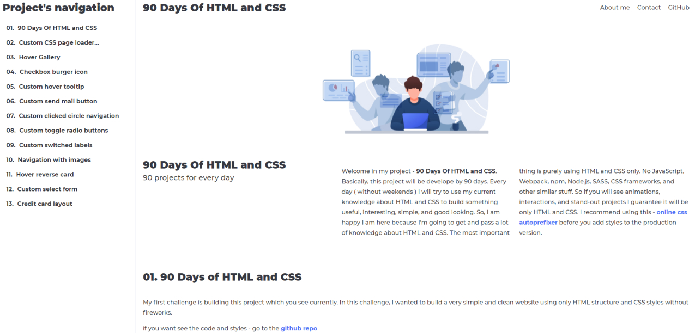

# 90daysOfHtmlAndCss

## Welcome in my project 90daysOfHtmlAndCss
90 Days Of HTML and CSS. Basically, this project will be
develope by 90 days. Every day ( without weekends ) I
will try to use my current knowledge about HTML and CSS
to build something useful, interesting, simple, and
good-looking. So, I am happy because I'm going to show
and convey to you a lot of knowledge especially about
CSS. Based on my projects you can learn how to use CSS
in a very creative way. The most important thing is: all
projects will be created purely using HTML and CSS only.
No JavaScript, Webpack, npm, Node.js, SASS, CSS
frameworks, and other similar stuff. So if you will see
animations, interactions, and stand-out effects, I
guarantee you. It will be HTML and CSS only without any
single line of JS code.
## What you will learn? 
- HTML and CSS only (especially CSS tricks)
- How to create amazing projects
- How to use css features in creative ways
- How to use combinators
- How create animations
- How to substitute JS to CSS
- How to create programming illusion
- Discovering new features of CSS
- And so on and so for :)
## What you won't learn?
- JavsScript
- Webpack
- Node
- Sass
- Npm
- CSS Frameworks (Tailwind, Bootstrap, Materialize, Bulma etc.)
## For who is this project?
- For everyone who want to learn pure HTML and CSS tricks
## How to use this project?
Go to my website - [90DaysOfHTMLandCSS](https://krzysztofgrudzien.github.io/90daysOfHtmlAndCss/)
IMPORTANT - the section About me isn't working now because I am completely rebuilding my personal website.
On the left, there is a navigation of the project, so if you click on the link you will go directly to the project on the right side.
There is a html and css code from codepen.io when I put all projects.
Due to some projects are too big, the convenient way is to open original source when you click on the link below "Edit on CODEPEN - on the top right"
## What tools I am using?
- VSC
- Figma or Adobe XD
- My brain 🤯
## Why this html code is without attributes?
 - Because you can customize code by adding all attributes and properties you currently know. The code should be more specific and simple so I recommend substitute raw tags. 
## Next PROJECTS
I will be glad if you click on the heart button under the codepen project and write a nice comment. 
If you want to give me some advice about the project, what should change, go ahead - write a comment or send me an e-mail. 
krzysztof.grudzien.fed@gmail.com
I will try to build a lot of very useful projects for you because I know the work I do is worth it :)
## Last word!
I wish you a lot of fun using CSS tricks. Don't afraid to change the code. Everything up to you what your project should be looks like.